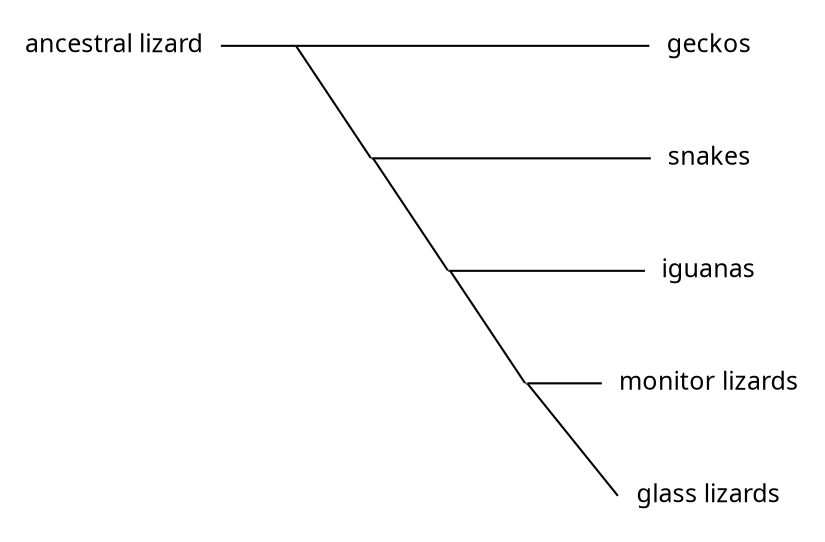

# Phylogeny Diagram

```dot

digraph G{

fixedsize="true"
splines ="false"
rankdir="LR"
graph [fontname = "sans-serif"];
node [fontname = "sans-serif" fontsize="12"];
edge [fontname = "sans serif"; arrowhead = "none";  ];
node [shape="none"; ]

  "ancestral lizard" 
  geckos
  snakes
  iguanas
  "monitor lizards"
  "glass lizards"

a [shape = "point" label="" width=0.001]
b [shape = "point" label="" width=0.001]
c [shape = "point" label="" width=0.001]
d [shape = "point" label="" width=0.001]


a -> b -> c -> d 

"ancestral lizard" -> a -> geckos [weight=100]
b -> snakes
c -> iguanas
d -> "monitor lizards"
d -> "glass lizards" :w


 {rank = same; 

  geckos
  snakes
  iguanas
  "monitor lizards"
  "glass lizards"
 }
}

```