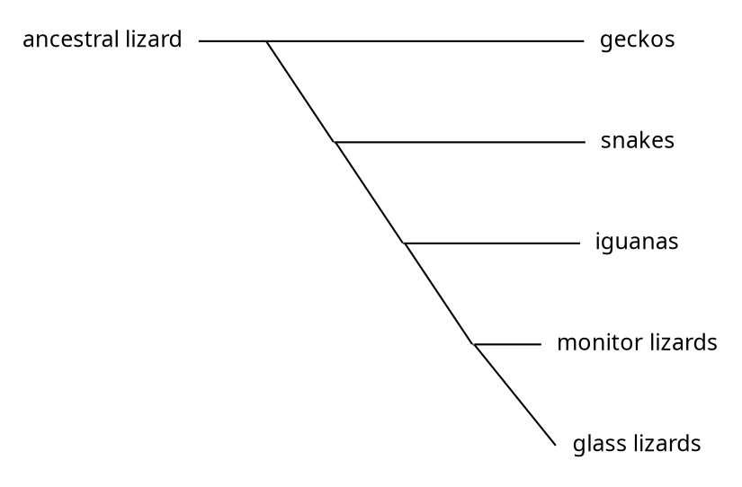

# Phylogeny
A phylogeny is directed graph which describes the evolutionary relationships between groups of organisms.

A phylogeny is a useful tool to organise a [[taxonomy]] of complex multicellular organisms. [Horizontal genetic transfer](horizontal-genetic-transfer.md) creates complex evolutionary relationships in which a species may be connected by more than one path. 

"Sequence comparisons suggest recent horizontal transfer of many genes among diverse species including across the boundaries of phylogenetic 'domains'. Thus determining the phylogenetic history of a species can not be done conclusively by determining evolutionary trees for single genes." [1](#f1)

 

See:

 

1
"Ulrich Melcher (2001) "Molecular genetics: Horizontal gene transfer," Oklahoma State University (Stillwater, Oklahoma USA)". 

Taken from Wikipedia Retrieved 2020-07-12 
https://en.wikipedia.org/wiki/Horizontal_gene_transfer 

Wikipedia reference :
Archived from the original on 2016-03-04. Retrieved 2015-08-20.

 [↩](#a1)

[[systematics]]

[systematics]: systematics.md

[//begin]: # "Autogenerated link references for markdown compatibility"
[systematics]: systematics "Systematics"
[//end]: # "Autogenerated link references"